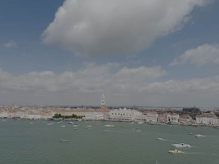

*Intentional left blank*

## Summary

Development image for working on MacOS.

### Local setup

- Register an account with [Docker Hub](https://hub.docker.com) and create an personal access token (PAT)
- Install the following

```console
Docker Desktop
hadolint
```
- Clone this repo
- Authenticate with Docker Hub

```console
docker login -u <USER> -p <PAT>
```
- Build

```console
docker build -t hoangqt/docker-mac .
```
- Tag the image

```console
docker tag -t hoangqt/docker-mac:latest hoangqt/docker-mac:latest
```

- Publish to Docker Hub

```console
docker push hoangqt/docker-mac:latest
```
